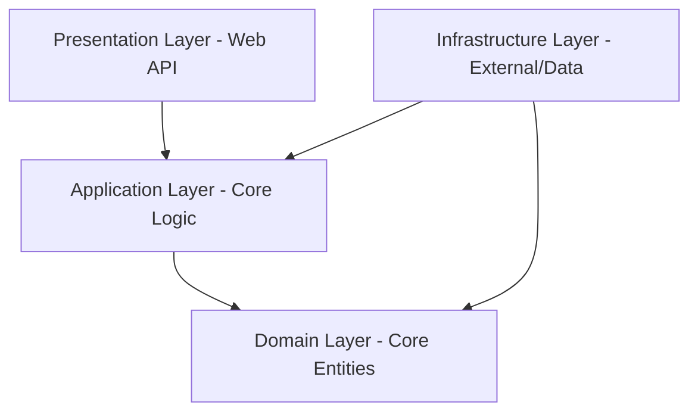

# ⚽🎮 Shamelco (PaaS)

[](https://dotnet.microsoft.com/en-us/)
[](https://learn.microsoft.com/en-us/ef/core/)
[]()
[](https://www.hangfire.io/)

Shamelco is a premium, high-performance **Platform-as-a-Service (PaaS)** solution designed specifically for managing sports facilities (football/sports pitches) and entertainment venues (cafes, boardgame lounges, and gaming zones). It provides real-time floor plans, cashier flows, automated duration-based billing, slot-based schedule booking, and secure transaction ledgering.

---

## 🗺️ Project Visual Tour & Diagrams

This section contains 12 placeholders for diagrams and system layouts. Replace these placeholder files in `docs/assets/images/` as your visual assets are compiled.

### 1. Database Schema Diagram

A complete representation of the relational database, including primary/foreign keys, TPH inheritance tables, unique indexes, and concurrency tokens.


### 2. Authentication & Refresh Tokens

Shows the flow of strategies (Google vs. Local Identity), JWT issuance, and the token rotation ledger.


### 3. Unified Booking Engine

Visualizes the lifecycle of a booking (`Pending` ➔ `Confirmed` ➔ `In-Progress` ➔ `Completed` / `Cancelled`) with concurrency controls.


### 4. Gaming Consoles & Venue Tables (Materials)

Illustrates how console hardware links to tables and how operational locking behaves during active sessions.


### 5. Notification System

Demonstrates real-time user notification pathways for status changes and confirmations.


### 7. Core Resources (Venues, Staff, Pitches, Blocks)

Shows how pitch and venue resources are defined, alongside venue staff assignments and maintenance blocks.


### 8. Review & Rating Mechanism

Depicts customer feedback loops, including the strict completion check constraint before a review can be submitted.


### 9. Active Play & Venue Sessions

Displays TPH (Table-Per-Hierarchy) sessions tracking real-time playing intervals and consolidated orders billing.


### 11. User Profiles & Identity Roles

Visualizes user types (Customers, Owners, Staff) inheriting from ASP.NET Identity with corresponding profiles.


### 12. Provider Reports

Displays wallet structures, balance tracking, and ledger entries for audits.


---

## 🏛️ Architecture Overview (Clean Architecture)

Shamelco is built following **Clean Architecture** patterns combined with **CQRS (Command Query Responsibility Segregation)** via MediatR. This ensures that the codebase remains highly testable, decoupled, and scalable.



### 1. [Domain](file:///d:/ProApp/ShamelcoApp/Domain)

Contains enterprise-wide business models, entities, value objects, exceptions, results wrapper, and enum definitions. This layer has **zero dependencies** on external libraries or frameworks (except for core language features).

- **Location:** [Domain Project](file:///d:/ProApp/ShamelcoApp/Domain/Domain.csproj)

### 2. [Application](file:///d:/ProApp/ShamelcoApp/Application)

Contains use cases, handlers, input request validation (FluentValidation), mapping DTOs, and interface abstractions for external integrations (such as database context, file hosting, and scheduling).

- **Location:** [Application Project](file:///d:/ProApp/ShamelcoApp/Application/Application.csproj)

### 3. [Infrastructure](file:///d:/ProApp/ShamelcoApp/Infrastructure)

Implements external services, database configuration (EF Core with SQL Server), Identity stores, background worker configurations (Hangfire), file upload clients (Cloudinary), and payment processors.

- **Location:** [Infrastructure Project](file:///d:/ProApp/ShamelcoApp/Infrastructure/Infrastructure.csproj)

### 4. [Presentation](file:///d:/ProApp/ShamelcoApp/Presentation)

Serves as the entry point of the application. It consists of "thin" ASP.NET Core Web API Controllers that map incoming HTTP request bodies to MediatR Commands/Queries and dispatch them.

- **Location:** [Presentation Project](file:///d:/ProApp/ShamelcoApp/Presentation/Presentation.csproj)

---

## 🔧 Core Domain Entity Specifications

The system database model is divided into 11 specialized entity folders under the `Domain/Entities` path:

### 1. Auth (Authentication)

- **Main Entity:** `RefreshToken`
- **Role:** Manages secure authentication sessions. Extends standard Identity tokens to allow persistent login states across multiple client agents.
- **Key Properties:**
  - `TokenHash` (String, hashed security token)
  - `ExpiresAt` (DateTimeOffset, expiration timebox)
  - `IsRevoked` (Boolean, state control)
  - `CreatedByIp` & `CreatedByUserAgent` (Auditing claims)

### 2. Bookings

- **Main Entity:** `Booking`
- **Role:** Serves as the central transaction record for renting either a pitch or a venue table.
- **Key Properties:**
  - `BookingNumber` (String, unique reference code)
  - `CustomerId` & `Customer` (Customer profile relationship)
  - `StartTime` & `EndTime` (Time-boxed constraints)
  - `TotalAmount`, `PlatformCommission`, `ProviderAmount` (Financial records)
  - `Status` (`BookingStatus` Enum: Pending, Confirmed, In-Progress, Completed, Cancelled)
  - `RowVersion` (Byte array, EF Core optimistic concurrency token)

### 3. Materials

- **Entities:** `GamingConsole`, `VenueTable`
- **Role:** Handles the physical assets located inside a venue that are rented out to customers.
- **Key Properties:**
  - `GamingConsole`: `Name`, `SerialNumber`, `HourlyRate`, `VenueId`
  - `VenueTable`: `TableNumber`, `Capacity`, `ConsoleId` (nullable FK to GamingConsole), `VenueId`, `HasConsole` (derived boolean flag)

### 4. Notifications

- **Main Entity:** `Notification`
- **Role:** Stores communications generated for user profiles.
- **Key Properties:**
  - `UserId` & `Title` & `Message` (Notification target and payload)
  - `IsRead` (Boolean, check state)
  - `CreatedAt` (DateTimeOffset)

### 5. Payments

- **Main Entity:** `Payment`
- **Role:** Tracks financial transactions verified via merchant gateways (e.g., Paymob).
- **Key Properties:**
  - `Amount` (Decimal, transaction value)
  - `PaymentDate` (DateTimeOffset)
  - `PaymobOrderId` & `TransactionReference` (Third-party merchant references)

### 6. Resources

- **Entities:** `Venue`, `Pitch`, `VenueStaff`, `PitchBlock`
- **Role:** Models the main revenue-generating facilities and staff permissions.
- **Key Properties:**
  - `Venue`: `Name`, `TableHoureRate`, `Address`, `MainImage`, `Rating`, `OwnerId`, `IsActive`, `IsOpen`
  - `Pitch`: `Name`, `HourlyRate`, `Capacity`, `Address`, `MainImage`, `Rating`, `OwnerId`
  - `VenueStaff`: `VenueId`, `UserId`, `Role`, `IsActive` (supports global soft delete)
  - `PitchBlock`: `PitchId`, `StartTime`, `EndTime`, `Reason` (manual blackout window override)

### 7. Reviews

- **Main Entity:** `Review`
- **Role:** Captures customer feedback for venues and pitches post-checkout.
- **Key Constraints:** Eligible **ONLY** if the associated booking status is `Completed`.
- **Key Properties:**
  - `PlaceId` (Target resource)
  - `CustomerId` & `Score` (Rating out of 5 stars)
  - `Comment` (Nullable review body)

### 8. Sessions

- **Entities:** `BaseSession` (TPH base), `PitchSession`, `VenueSession`
- **Role:** Tracks the live execution of table or pitch activities.
- **Key Properties:**
  - `BaseSession`: `StartTime`, `EndTime`, `TotalAmount`, `PaymentId`
  - `PitchSession`: `CustomerId` (nullable), `WalkInCustomerName` (for on-the-spot players), `PitchId`, `BookingId`, `ExpectedEndTime`
  - `VenueSession`: `CustomerId`, `TableId` (nullable), `Date`, `ConsoleStartTime`, `ConsoleCloseTime`

### 9. Transactions

- **Entities:** `Transaction`, `PayoutRequest`
- **Role:** Audits wallet transfers and processes provider payout operations.
- **Key Properties:**
  - `Transaction`: `WalletId`, `BookingId` (nullable), `Amount`, `Description`
  - `PayoutRequest`: `WalletId`, `Amount`, `AccountDetails`, `CreatedAt`, `ProcessedAt`, `AdminNotes`

### 10. Users

- **Entities:** `ApplicationUser`, `ApplicationRole`, `CustomerProfile`, `OwnerProfile`, `StaffProfile`
- **Role:** Encapsulates identity credentials using ASP.NET Core Identity with customizable profile models.
- **Key Properties:**
  - `ApplicationUser`: `FullName`, `ImagePath`, `CreatedAt`
  - `CustomerProfile`: `UserId`, `LoyaltyPoints`
  - `OwnerProfile`: `UserId`, `BusinessName`, `TaxNumber`
  - `StaffProfile`: `UserId`, `EmployeeNumber`, `AssignedVenueId`

### 11. Wallets

- **Main Entity:** `Wallet`
- **Role:** Holds monetary balances for platform users or providers.
- **Key Properties:**
  - `ProviderId` (Identifier linking to the provider)
  - `Balance` (Decimal, current funds)

---

## ⚡ Key System constraints & Logic

### 1. Real-Time Concurrency Guard

During booking creation, the handler executes a database-level check:

```sql
SELECT COUNT(*) FROM Bookings
WHERE PitchId = @PitchId
  AND Status IN ('Pending', 'Confirmed', 'In-Progress')
  AND StartTime < @EndTime AND EndTime > @StartTime
```

If an overlap exists, EF Core throws a `Conflict` result. Under high loads, an EF Core optimistic concurrency token (`RowVersion`) prevents double bookings.

### 2. Soft Delete Enforcement

To ensure financial auditing compliance, hard deletions are forbidden. All components enforce soft delete:

- `VenueStaff` is deactivated via `IsActive = false` (filtered via EF Core Global Query Filter).
- Cancelled Bookings update status to `Cancelled` rather than being purged.

### 3. Venue Asset Lock Constraint

- A console is locked to its `VenueTable` while an active session is in progress.
- Consoles can only be moved or reassigned to other tables if the source table status is `Available`.

### 4. Sessions & POS Rules

- All Food & Beverage (F&B) orders are linked to the `SessionId` (not `TableId`).
- Cashiers cannot close a session if there are `Pending` orders. Orders must be set to `Delivered` or `Cancelled` first.
- Billing Engine:
  - **Gaming Table:** `(Duration Hours * Console Rate) + F&B Orders`
  - **Cafe Table:** `F&B Orders` (Time-based fee is ignored).

---

## 🔌 API Documentation Summary

### 🔑 Authentication (`/api/v1/auth`)

| Endpoint                       | Method | Payload / Query            | Access     | Description                                                       |
| ------------------------------ | ------ | -------------------------- | ---------- | ----------------------------------------------------------------- |
| `/api/v1/auth/register`        | POST   | `RegisterRequestDto`       | Public     | Creates user account & profile in a single transaction            |
| `/api/v1/auth/login/local`     | POST   | `LocalLoginRequestDto`     | Public     | Local email/password login, returns JWT & HttpOnly refresh cookie |
| `/api/v1/auth/login/google`    | POST   | `GoogleLoginRequestDto`    | Public     | Google OAuth token login strategy                                 |
| `/api/v1/auth/refresh`         | POST   | Cookie                     | Public     | Renews JWT using refresh token cookie                             |
| `/api/v1/auth/revoke`          | POST   | Cookie                     | Authorized | Revokes refresh token & clears cookies (Logout)                   |
| `/api/v1/auth/change-password` | POST   | `ChangePasswordRequestDto` | Authorized | Changes authenticated user password                               |
| `/api/v1/auth/forgot-password` | POST   | `ForgotPasswordRequestDto` | Public     | Initiates password reset flow                                     |
| `/api/v1/auth/reset-password`  | POST   | `ResetPasswordRequestDto`  | Public     | Resets user password using reset token                            |
| `/api/v1/auth/me`              | GET    | -                          | Authorized | Retrieves currently authenticated user profile info               |

### ⚽ Pitches (`/api/v1/pitches`)

| Endpoint                            | Method | Payload / Query                               | Access | Description                                         |
| ----------------------------------- | ------ | --------------------------------------------- | ------ | --------------------------------------------------- |
| `/api/v1/pitches`                   | GET    | `page`, `pageSize`, `governorateId`, `cityId` | Public | List paginated pitches with location filtering      |
| `/api/v1/pitches/{id}`              | GET    | -                                             | Public | Get full pitch details by ID                        |
| `/api/v1/pitches/{id}/availability` | GET    | `date`                                        | Public | Get pitch time-slot availability for specified date |
| `/api/v1/pitches/add`               | POST   | `AddPitchRequest`                             | Owner  | Register a new pitch facility                       |
| `/api/v1/pitches/{id}`              | PUT    | Form (`UpdatePitchRequest`)                   | Owner  | Update pitch details, working hours, rates & image  |
| `/api/v1/pitches/{id}/block`        | POST   | `BlockPitchRequest`                           | Owner  | Create blackout window block for pitch maintenance  |

### 🎮 Venues & Hardware Materials (`/api/v1/venues`)

| Endpoint                                                              | Method | Payload / Query                               | Access     | Description                                     |
| --------------------------------------------------------------------- | ------ | --------------------------------------------- | ---------- | ----------------------------------------------- |
| `/api/v1/venues`                                                      | GET    | `page`, `pageSize`, `governorateId`, `cityId` | Public     | List paginated venues with location filtering   |
| `/api/v1/venues/{id}`                                                 | GET    | -                                             | Public     | Get full venue details by ID                    |
| `/api/v1/venues/{venueId}/floor-plan`                                 | GET    | -                                             | Authorized | Get live floor plan view for venue tables       |
| `/api/v1/venues/add`                                                  | POST   | `AddVenueRequest`                             | Owner      | Register a new venue facility                   |
| `/api/v1/venues/{venueId}`                                            | PUT    | Form (`UpdateVenueRequest`)                   | Owner      | Update venue information, working hours & image |
| `/api/v1/venues/{venueId}/tables`                                     | POST   | `AddVenueTableRequest`                        | Owner      | Add new table to venue                          |
| `/api/v1/venues/{venueId}/tables/{tableId}`                           | GET    | -                                             | Public     | Get venue table details                         |
| `/api/v1/venues/{venueId}/tables/{tableId}`                           | PUT    | `UpdateVenueTableRequest`                     | Owner      | Update table number, status, or capacity        |
| `/api/v1/venues/{venueId}/tables/{tableId}`                           | DELETE | -                                             | Owner      | Soft delete venue table                         |
| `/api/v1/venues/{venueId}/tables/{tableId}/availability`              | GET    | `date`                                        | Public     | Check venue table availability for target date  |
| `/api/v1/venues/{venueId}/consoles`                                   | POST   | `AddConsoleRequest`                           | Owner      | Add gaming console hardware asset               |
| `/api/v1/venues/{venueId}/consoles/unassigned`                        | GET    | `page`, `pageSize`                            | Authorized | List unassigned gaming consoles                 |
| `/api/v1/venues/{venueId}/consoles/{consoleId}`                       | DELETE | -                                             | Owner      | Remove gaming console hardware asset            |
| `/api/v1/venues/{venueId}/table/{tableId}consoles/{consoleId}/assign` | PUT    | -                                             | Authorized | Assign gaming console hardware to table         |
| `/api/v1/venues/{venueId}/tables/{tableId}/remove-console`            | DELETE | -                                             | Owner      | Unassign console hardware from table            |
| `/api/v1/venues/{venueId}/staff`                                      | GET    | `page`, `pageSize`                            | Owner      | List staff assigned to venue                    |
| `/api/v1/venues/{venueId}/staff`                                      | POST   | `AddStaffRequest`                             | Owner      | Assign staff member profile to venue            |
| `/api/v1/venues/{venueId}/staff/{staffId}`                            | DELETE | `RevokeVenueRequest`                          | Owner      | Revoke staff member access                      |

### 📅 Bookings (`/api/v1/bookings`)

| Endpoint                                      | Method | Payload / Query             | Access     | Description                                     |
| --------------------------------------------- | ------ | --------------------------- | ---------- | ----------------------------------------------- |
| `/api/v1/bookings/pitch`                      | POST   | `CreatePitchBookingRequest` | Authorized | Create customer pitch booking reservation       |
| `/api/v1/bookings/venue`                      | POST   | `CreateVenueBookingRequest` | Authorized | Create customer venue table booking reservation |
| `/api/v1/bookings/{id}`                       | GET    | -                           | Authorized | Get booking details by ID                       |
| `/api/v1/bookings/customer`                   | GET    | `page`, `pageSize`          | Authorized | List bookings for current customer              |
| `/api/v1/bookings/pitch/{pitchId}`            | GET    | `page`, `pageSize`          | Authorized | List bookings for specific pitch                |
| `/api/v1/bookings/venue-table/{venueTableId}` | GET    | `page`, `pageSize`          | Authorized | List bookings for specific venue table          |
| `/api/v1/bookings/{id}/cancel`                | POST   | -                           | Authorized | Cancel active booking                           |
| `/api/v1/bookings/{id}/reschedule`            | POST   | `RescheduleBookingRequest`  | Authorized | Reschedule booking start and end time           |

### ⭐ Reviews & Feedback (`/api/v1/reviews`)

| Endpoint                          | Method | Payload / Query       | Access     | Description                                                |
| --------------------------------- | ------ | --------------------- | ---------- | ---------------------------------------------------------- |
| `/api/v1/reviews`                 | POST   | `SubmitReviewRequest` | Authorized | Submit customer feedback review for completed booking      |
| `/api/v1/reviews`                 | PUT    | `ReviewDto`           | Authorized | Update existing review (recalculates place average rating) |
| `/api/v1/reviews/{id}`            | PUT    | `ReviewDto`           | Authorized | Update review by ID (recalculates place average rating)    |
| `/api/v1/reviews/{id}`            | GET    | -                     | Authorized | Get review details by ID                                   |
| `/api/v1/reviews/customer`        | GET    | `page`, `pageSize`    | Authorized | List reviews submitted by current customer                 |
| `/api/v1/reviews/place/{placeId}` | GET    | `page`, `pageSize`    | Authorized | List reviews for a specific pitch or venue                 |

### 🔍 Customer Profile & Place Discovery (`/api/v1/customer`)

| Endpoint                            | Method | Payload / Query                                            | Access     | Description                               |
| ----------------------------------- | ------ | ---------------------------------------------------------- | ---------- | ----------------------------------------- |
| `/api/v1/customer/profile`          | GET    | -                                                          | Authorized | Get customer profile details              |
| `/api/v1/customer/profile`          | PUT    | Form (`UpdateCustomerProfileCommand`)                      | Authorized | Update customer profile and profile image |
| `/api/v1/customer/places/search`    | GET    | `searchTerm`, `category`, `typeFilter`, `page`, `pageSize` | Public     | Global search across pitches & venues     |
| `/api/v1/customer/places/top-rated` | GET    | `page`, `pageSize`                                         | Public     | List top-rated pitches & venues           |

### 🏢 Owner Management (`/api/v1/Owner`)

| Endpoint                | Method | Payload / Query                    | Access | Description                                       |
| ----------------------- | ------ | ---------------------------------- | ------ | ------------------------------------------------- |
| `/api/v1/Owner/profile` | GET    | -                                  | Owner  | Get owner profile details                         |
| `/api/v1/Owner`         | PUT    | Form (`UpdateOwnerProfileRequest`) | Owner  | Update owner profile information & business image |

### 📈 Reports & Analytics (`/api/v1/reports`)

| Endpoint                         | Method | Parameters                                               | Access | Description                                      |
| -------------------------------- | ------ | -------------------------------------------------------- | ------ | ------------------------------------------------ |
| `/api/v1/reports/kpis/{Id}`      | GET    | `type`, `startDate`, `endDate`                           | Owner  | Consolidated revenue, booking & performance KPIs |
| `/api/v1/reports/payments/{Id}`  | GET    | `type`, `startDate`, `endDate`                           | Owner  | Payment breakdown by gateway/method              |
| `/api/v1/reports/occupancy/{Id}` | GET    | `type`, `startDate`, `endDate`                           | Owner  | Peak/hourly occupancy utilization analytics      |
| `/api/v1/reports/bookings/{Id}`  | GET    | `type`, `startDate`, `endDate`, `pageNumber`, `pageSize` | Owner  | Detailed paginated bookings report               |
| `/api/v1/reports/export/{Id}`    | GET    | `type`, `startDate`, `endDate`                           | Owner  | Downloadable analytics report file export        |

### 📊 Owner Dashboards (`/api/v1/dashboard`)

| Endpoint                              | Method | Parameters | Access | Description                                         |
| ------------------------------------- | ------ | ---------- | ------ | --------------------------------------------------- |
| `/api/v1/dashboard/pitches/{pitchId}` | GET    | -          | Owner  | Real-time owner pitch performance dashboard         |
| `/api/v1/dashboard/venues/{venueId}`  | GET    | -          | Owner  | Real-time owner venue & table performance dashboard |

### 📍 Locations (`/api/v1/locations`)

| Endpoint                                                | Method | Parameters | Access | Description                             |
| ------------------------------------------------------- | ------ | ---------- | ------ | --------------------------------------- |
| `/api/v1/locations/governorates`                        | GET    | -          | Public | List all Egyptian governorates          |
| `/api/v1/locations/governorates/{governorateId}/cities` | GET    | -          | Public | List cities under specified governorate |

### 🔔 Notifications (`/api/v1/notifications`)

| Endpoint                          | Method | Parameters         | Access     | Description                                   |
| --------------------------------- | ------ | ------------------ | ---------- | --------------------------------------------- |
| `/api/v1/notifications`           | GET    | `page`, `pageSize` | Authorized | List paginated notifications for current user |
| `/api/v1/notifications/{id}/read` | PUT    | -                  | Authorized | Mark notification as read                     |

### 💳 Payments & Gateway (`/api/v1/Payment`)

| Endpoint                   | Method | Payload / Parameters     | Access      | Description                                 |
| -------------------------- | ------ | ------------------------ | ----------- | ------------------------------------------- |
| `/api/v1/Payment/initiate` | POST   | `InitiatePaymentRequest` | Public/Auth | Initiate payment via Paymob / Mobile Wallet |
| `/api/v1/Payment/webhook`  | POST   | Query `hmac`, Body JSON  | Public      | Paymob HMAC-verified webhook callback       |

---

## 🛠️ Setup & Local Installation

### Prerequisites

- [.NET 9.0 SDK](https://dotnet.microsoft.com/en-us/download/dotnet/9.0)
- SQL Server (LocalDB or Docker instance)
- [Hangfire Dashboard](https://www.hangfire.io/) support (Requires database schema)

### Installation Steps

1. **Clone the Repository:**

   ```bash
   git clone https://github.com/ahmedragab13579/Shamelco.git
   cd Shamelco
   ```

2. **Configure Database Connection String:**
   Open [appsettings.json](file:///d:/ProApp/ShamelcoApp/Presentation/appsettings.json) and update the ConnectionString:

   ```json
   "ConnectionStrings": {
     "DefaultConnection": "Server=(localdb)\\mssqllocaldb;Database=ShamelcoDb;Trusted_Connection=True;MultipleActiveResultSets=true"
   }
   ```

3. **Restore Nuget Packages:**

   ```bash
   dotnet restore
   ```

4. **Apply EF Core Migrations:**

   ```bash
   dotnet ef database update --project Infrastructure --startup-project Presentation
   ```

5. **Run the API Host:**
   ```bash
   dotnet run --project Presentation
   ```
   The API Swagger/OpenAPI documentation will be accessible at: `https://localhost:7111/swagger` (or matching port configurations).

---

## 📊 Solution Dependencies

- **Core Framework:** .NET 9.0 (C#)
- **Object Mapping:** MediatR (CQRS pipeline behavior patterns)
- **Validation:** FluentValidation.DependencyInjection
- **Background Processing:** Hangfire Core & SQL Server Storage
- **Hosting Integrations:** CloudinaryDotNet (Media Storage)
- **Auth Providers:** Microsoft.AspNetCore.Authentication.JwtBearer / Google.Apis.Auth
